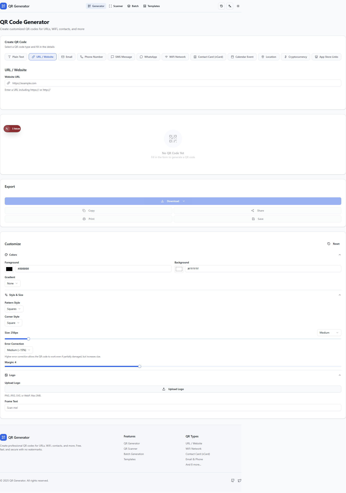
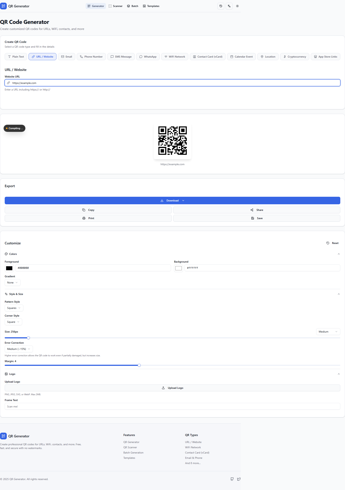
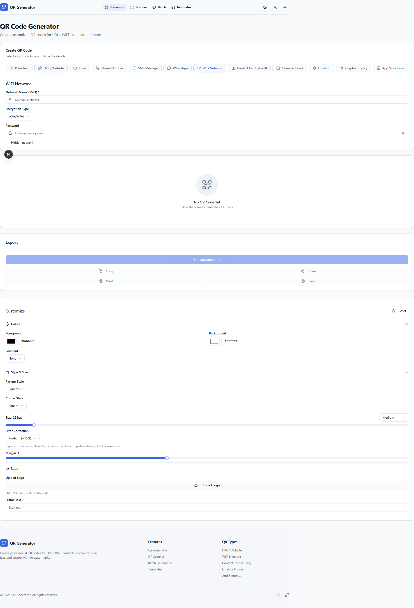
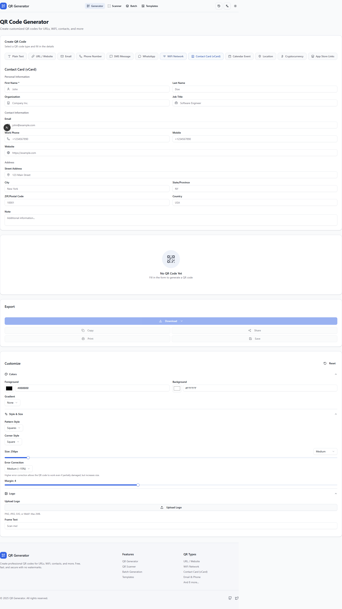
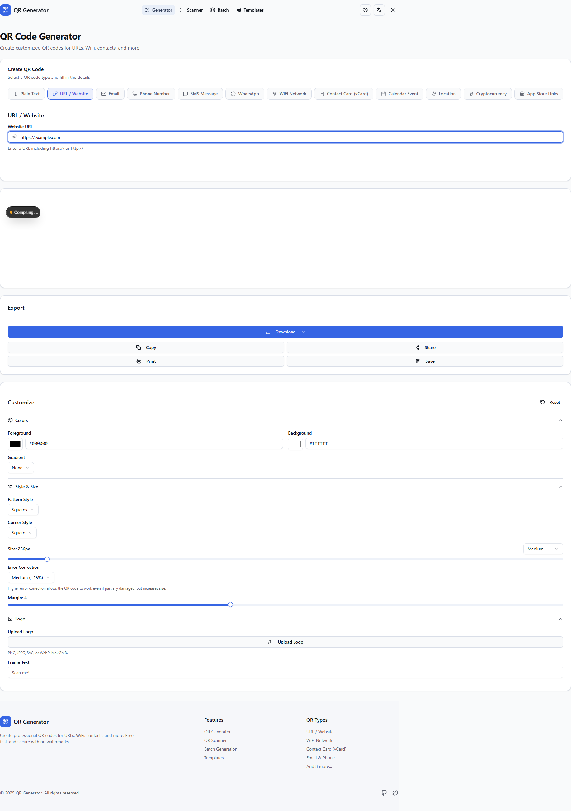
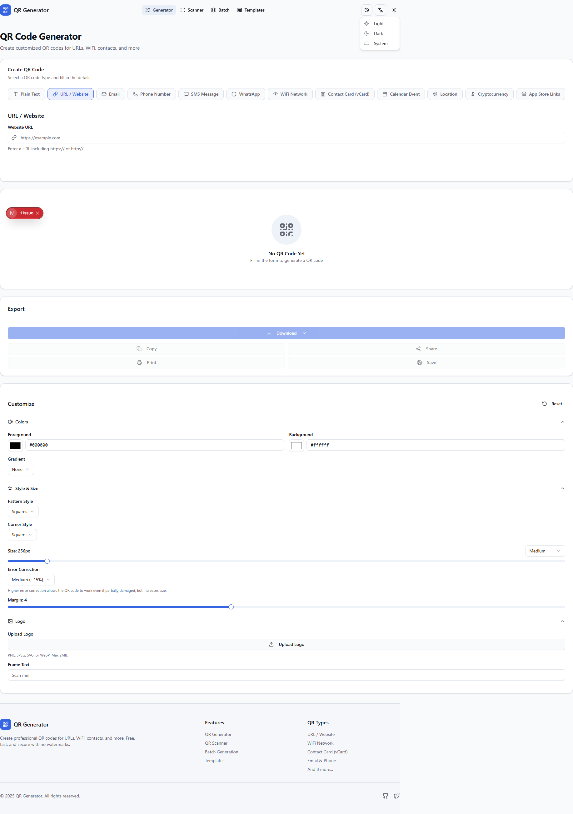
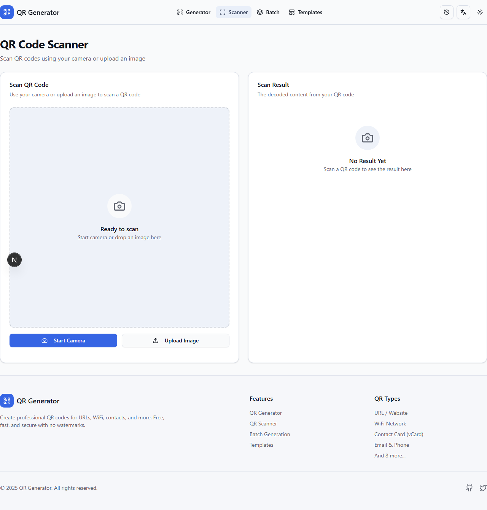
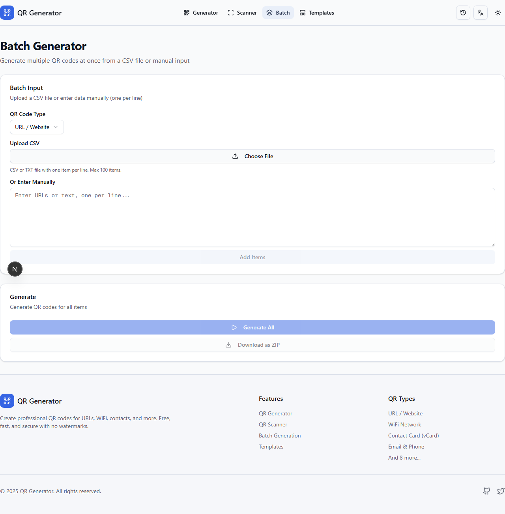
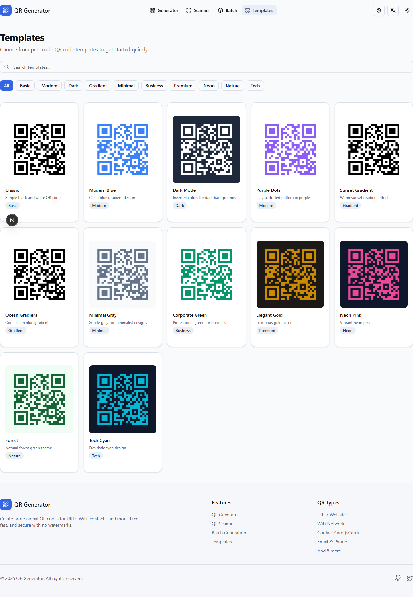
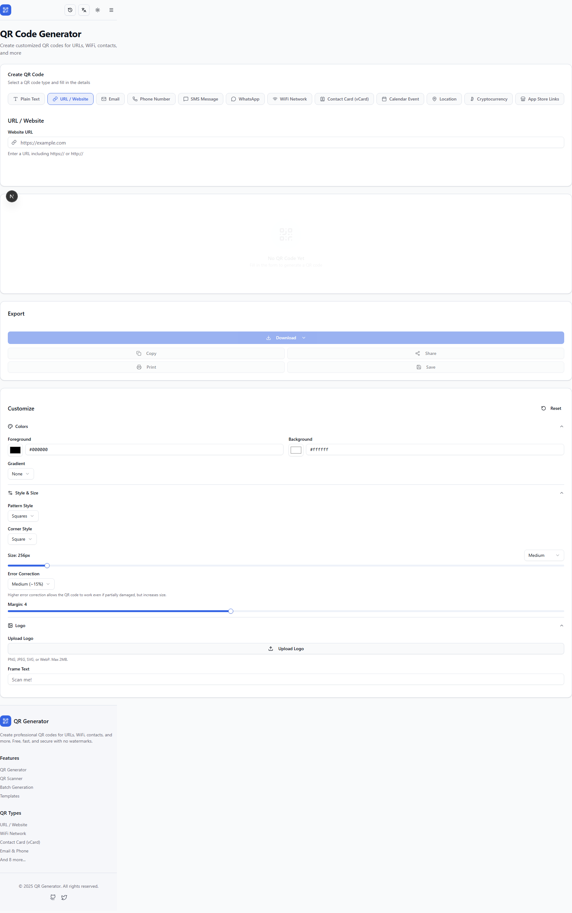

# QR Code Generator

A modern, feature-rich QR code generator built with Next.js 15, featuring real-time preview, extensive customization options, and multi-language support (English & Arabic).



## Features

- **12 QR Code Types**: URL, Plain Text, Email, Phone, SMS, WhatsApp, WiFi, vCard (Contact), Calendar Event, Location, Cryptocurrency, and App Store Links
- **Real-time Preview**: See your QR code as you type
- **Extensive Customization**: Colors, gradients, patterns, corner styles, sizes, error correction levels, and logos
- **Multiple Export Formats**: PNG, SVG, PDF, JPEG, WebP
- **QR Code Scanner**: Scan QR codes using camera or image upload
- **Batch Generation**: Generate multiple QR codes at once from CSV or manual input
- **Templates**: Pre-made QR code styles for quick start
- **Multi-language Support**: English and Arabic (RTL supported)
- **Dark/Light Theme**: System-aware theme with manual toggle
- **History**: Track and restore previously generated QR codes
- **Responsive Design**: Works on desktop, tablet, and mobile

## Screenshots

### QR Code Generation


### WiFi QR Code


### vCard (Contact) QR Code


### Export Options


### Dark Theme


### QR Code Scanner


### Batch Generation


### Templates


### Mobile View


## Tech Stack

- **Framework**: Next.js 15 with App Router
- **Language**: TypeScript
- **Styling**: Tailwind CSS v4
- **UI Components**: shadcn/ui
- **State Management**: Zustand
- **Form Handling**: React Hook Form + Zod
- **Internationalization**: next-intl
- **QR Generation**: qrcode library
- **Testing**: Jest + React Testing Library + Playwright

## Getting Started

### Prerequisites

- Node.js 18.17 or later
- npm, yarn, pnpm, or bun

### Installation

1. Clone the repository:
```bash
git clone https://github.com/yourusername/qr-generator.git
cd qr-generator
```

2. Install dependencies:
```bash
npm install
```

3. Run the development server:
```bash
npm run dev
```

4. Open [http://localhost:3000](http://localhost:3000) in your browser.

## Scripts

```bash
# Development
npm run dev          # Start development server

# Build
npm run build        # Build for production
npm run start        # Start production server

# Testing
npm test             # Run unit tests
npm run test:watch   # Run tests in watch mode
npm run test:e2e     # Run E2E tests with Playwright

# Code Quality
npm run lint         # Run ESLint
npm run type-check   # Run TypeScript type checking
```

## Project Structure

```
src/
├── app/                    # Next.js App Router pages
│   ├── page.tsx           # Home page (QR Generator)
│   ├── scan/              # QR Scanner page
│   ├── batch/             # Batch generation page
│   └── templates/         # Templates page
├── components/
│   ├── layout/            # Header, Footer, Theme Toggle, Language Switcher
│   ├── qr/                # QR-related components
│   │   ├── forms/         # Form components for each QR type
│   │   ├── QRGenerator.tsx
│   │   ├── QRPreview.tsx
│   │   ├── QRCustomizer.tsx
│   │   ├── QRExporter.tsx
│   │   └── QRHistory.tsx
│   └── ui/                # shadcn/ui components
├── hooks/                 # Custom React hooks
├── lib/                   # Utility functions
│   ├── encoder.ts         # QR string encoding
│   ├── generator.ts       # QR code generation
│   └── validations.ts     # Input validation
├── stores/                # Zustand stores
├── types/                 # TypeScript type definitions
└── i18n/                  # Internationalization config
messages/
├── en.json               # English translations
└── ar.json               # Arabic translations
```

## Testing

### Unit & Integration Tests

```bash
npm test
```

212 tests covering:
- Utility functions (encoder, generator, validations)
- React hooks
- Zustand stores
- Form components
- QR components

### E2E Tests

```bash
npm run test:e2e
```

33 Playwright tests covering:
- Page navigation
- QR code generation flow
- Form interactions
- Theme switching
- Responsive design
- Accessibility

## Internationalization

The app supports:
- **English** (default)
- **Arabic** (with RTL support)

Language can be switched using the language toggle in the header. The preference is saved in a cookie.

## Customization Options

- **Colors**: Foreground, background, and gradient colors
- **Gradient Types**: None, Linear, Radial
- **Pattern Styles**: Squares, Dots, Rounded
- **Corner Styles**: Square, Rounded, Extra Rounded
- **Size Presets**: Small (128px) to Print Ready (1024px)
- **Error Correction**: Low (7%), Medium (15%), Quartile (25%), High (30%)
- **Logo**: Upload custom logo with adjustable size
- **Frame Text**: Add custom text below QR code

## License

MIT License - feel free to use this project for personal or commercial purposes.

## Author

Created with Next.js and deployed on Vercel.
